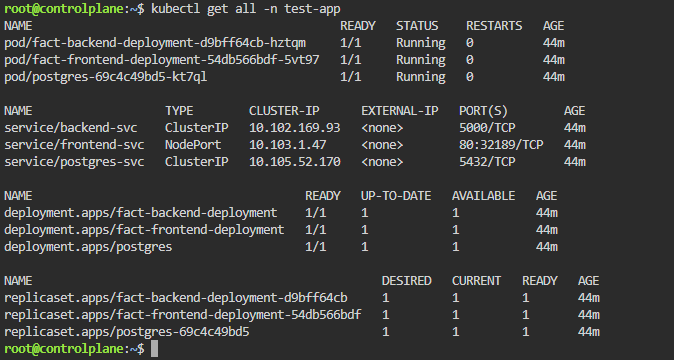
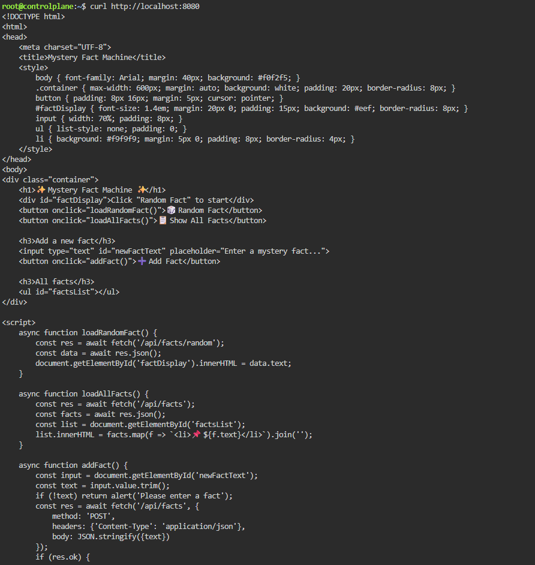
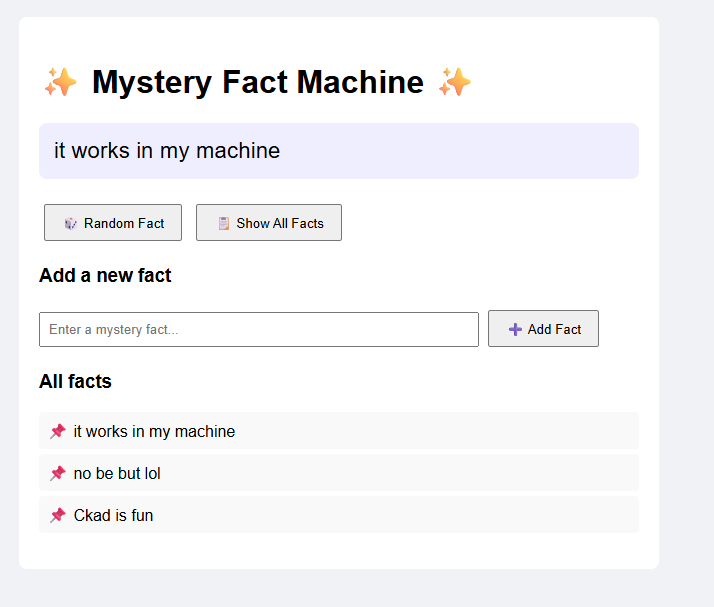
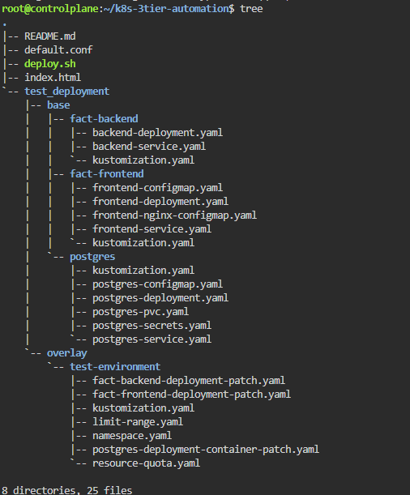

# 3-Tier K8s Automation: Phase 1

# Phase 1: Decoupled Microservices on Kubernetes (CKAD‑style)

**Author:** Su (CKAD, Sec+ candidate)  
**Goal:** Deploy a three‑tier application (PostgreSQL + Flask API + Nginx frontend) using **Kustomize**, **initContainers**, **resource governance**, and **declarative YAML**. No manual `kubectl` commands.  

This is the foundation of a **zero‑trust security lab**. 
Phase 2 will add network policies, security contexts, OPA, and image scanning.

---

## 📦 What’s Inside Phase 1

| Component           | Technology                     | Purpose                                                               |            
|---------------------|--------------------------------|-----------------------------------------------------------------------|
| **Database**        | PostgreSQL 15-alpine                  | Persistent storage for mystery facts                                  |
| **Backend**         | Flask API (Python)             | REST endpoints `/api/facts`, `/api/facts/random`, `/api/facts` (POST) |
| **Frontend**        | Nginx + static HTML            | Serves UI, proxies `/api/` to backend                                 |
| **Orchestration**   | Kustomize (overlays + patches) | Environment‑agnostic YAML composition                                 |
| **Governance**      | ResourceQuota + LimitRange     | CPU/memory limits, storage quota                                      |
| **Dependency mgmt** | initContainer                  | Waits for PostgreSQL to be ready                                      |

**No hardcoded service addresses** – Nginx proxies `/api` to the backend service. 

**No monolithic Flask** – The database, frontend and backend are separate containers, designed with modular Kustomize bases, following microservices best practices.

**Resilience via InitContainers** - Distributed systems often suffer from "race conditions" where the application tries to connect before the database is ready.
I implemented a `ReadinessProbe` using `pg_isready`. This ensures the database is not just only up, but is capable and ready to accept traffic.

**Governance and Noisy Neighbour** - `ResourceQuota` and `LimitRange` was implemented to enforce a "Fair Use" policy by setting default requests and hard limits on CPU/Memory. I ensured that a spike in one tier won't cause a Denial of Service (DOS) for the entire node or other application.

---

## Live Demo (Screenshots / Asciinema)

> Asciinema Recording

> `kubectl get all -n test-app` 
 

> `kubectl port-forward svc/frontend-svc 8080:80` → browser showing the Mystery Fact Machine.

---

## 📁 Repository Structure

---

## 🛠️ Prerequisites

- **Kubernetes cluster** (Minikube, Kind, KillerCoda, or any conformant cluster)
- **kubectl** (v1.24+)
- **kustomize** (built into `kubectl 1.14+`)
- **Docker** (only if you need to build the backend image – otherwise use the pre‑built `succesc/fact-app:v1`)

> The script uses `kubectl create --dry-run` to generate YAMLs, so no manual editing is required.

---

## 🚦 How to Run Phase 1

1. **Clone the repository**

   `git clone https://github.com/susu10-10/k8s-3tier-automation.git`
   `cd k8s-3tier-automation/`

2. Place the required files in the same directory as deploy.sh:
    > `index.html` (provided above) and `default.conf` (provided above)

3. Make the script executable
`chmod +x deploy.sh`

4. Run the script
`./deploy.sh`

    > it will display the kustomized manifest when prompted, type `y` to apply to your cluster. 

5. Verify Deployment
`kubectl get all -n test-app`

    > (All pods should be `Running` within 30-60 seconds)

6. Access the frontend

`kubectl port-forward -n test-app svc/frontend-svc 8080:80`

      http://localhost:8080 in your browser.
      Add a fact -> it appears. Click "Random Fact" -> a random fact is shown.

# 🔍  Key CKAD Concepts Demonstrated

| Concept      |       Where it appears      |
|--------------|----------------------------|
| Kustomize    | base/ + overlay/ with patches for environment‑specific config |
| initContainer| Backend waits for PostgreSQL TCP port |
| ResourceQuota + LimitRange| CPU (2 cores), memory (4Gi), per‑container defaults (128Mi request, 256Mi limit) |
| Declarative YAML generation |	kubectl create --dry-run – no imperative changes |
| ConfigMaps & Secrets| Frontend HTML, Nginx config, PostgreSQL credentials |
| Service discovery | backend-svc:5000 and postgres-svc:5432 (K8s DNS) |
| Volume mounts | PVC for PostgreSQL, ConfigMap mounts for frontend (with subPath)|

# 📊 Resource Governance

Namespace: `test-app` (PSA label `privileged` – will be tightened in Phase 2)

ResourceQuota:

CPU: 2 cores (requests + limits)

Memory: 4Gi

LimitRange:

Default request: 100m CPU / 128Mi memory

Default limit: 200m CPU / 256Mi memory

This prevents any single pod from starving the cluster and ensures predictable performance.

# 🗺️ What’s Next? (Phase 2 – Security Hardening)
Phase 2 will transform this working application into a zero‑trust, least‑privilege environment:

> Stay tuned – the same Kustomize structure will be extended with security overlays.

# 🤝 Contributing / Feedback

This is a personal learning project to demonstrate CKAD + Sec+ skills.
If you find a bug or have a suggestion, please open an issue or a pull request.

# 📜 License
MIT – feel free to use this as a template for your own security labs.

